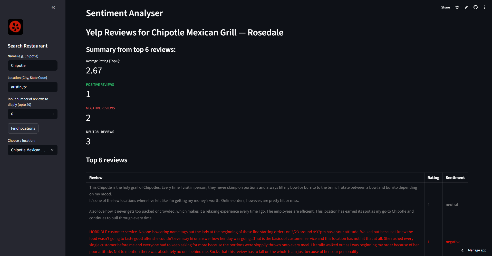

# Sentiment Analyser
A basic sentiment analyser that summarizes top yelp reviews from given restaurant location.

A Streamlit UI takes the restaurant name, location, and number of reviews to summarize and gives a dropdown list based on the name and location provided (this is based on the results given by SERP API.)

Once a location is chosen, we get the top reviews along with the sentiment for each and the counts of positive, negative, and neutral reviews (also gives the average ratings baded on selected reviews). 

The model that gives us the sentiment is an SVM model trained on tweets. 

Streamlit UI:

